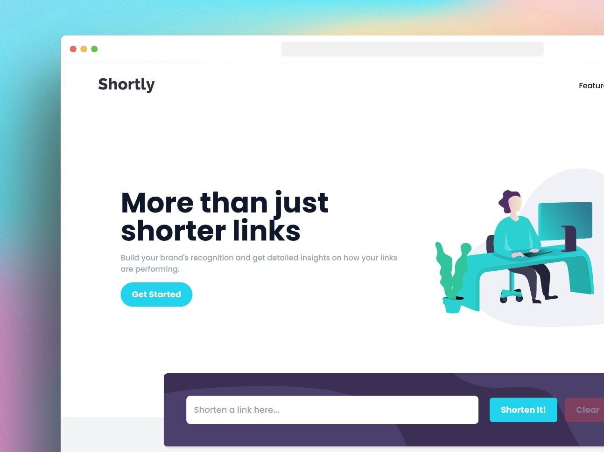
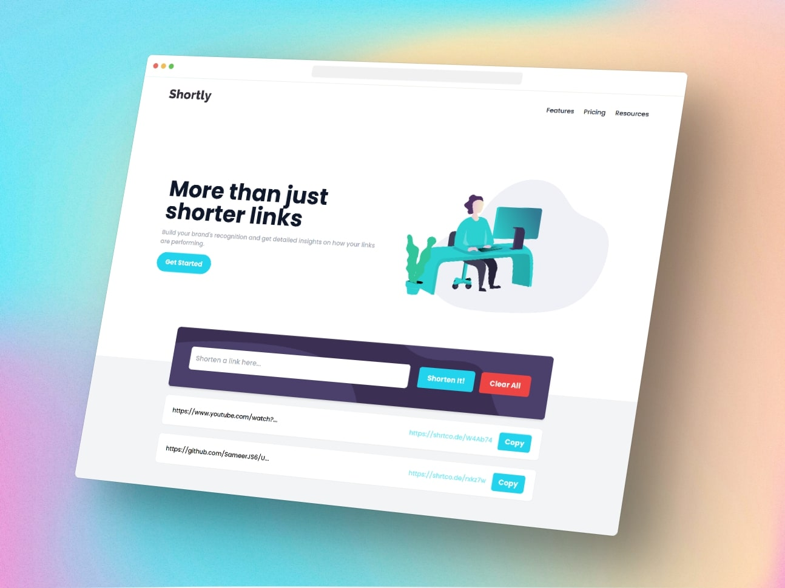

# Shortly URL shortening Challenge solution

This is a solution to the [Shortly URL shortening Challenge challenge on Frontend Mentor](https://www.frontendmentor.io/challenges/url-shortening-api-landing-page-2ce3ob-G).

## Table of contents

- [Overview](#overview)
  - [The challenge](#the-challenge)
  - [Screenshot](#screenshot)
  - [Links](#links)
- [My process](#my-process)
  - [Built with](#built-with)
  - [What I learned](#what-i-learned)
  - [Continued development](#continued-development)
- [Author](#author)

## Overview

### The challenge

Users should be able to:

- Shorten any valid URL.
- View the optimal layout for the site depending on their device's screen size.
- See a list of their shortened links, even after refreshing the browser.
- Copy the shortened link to their clipboard in a single click.
- Receive an error message when the `form` is submitted if:
  - The `input` field is empty

### Screenshot




### Links

- Solution URL: [Github](https://github.com/SameerJS6/URL-Shortening-App)
- Live Site URL: [Netlify](https://shrtco.de/JaAuI2)

## My process

- I started with the main functionality, which was fetching the data, and then moved on to building the UI.
- The building process for the UI was easy but also quite time-consuming, as this project had a whole page with different sections, such as CTA, Footer, Hero, etc. Overall, the process for this project was quite simple and easy, as there was nothing specifically unique about it. It was just another API project.
- Thank you.

### Built with

- Flexbox
- CSS Grid
- [React](https://reactjs.org/) - JS library
- Mobile-first workflow
- Semantic HTML5 markup
- [Tailwind](https://tailwindcss.com/) - A Utility First Class based CSS Framework

### What I learned

- In short, while working on this project, I didn't learn a lot of new things, but I did get to practice fetching data from an API and storing it in a state. Overall, it was a pretty nice and easy project to build.

- Here's the code I used to fetch data from the API:-

```JavaScript react
  const handleFetch = async () => {
    try {
      const response = await fetch(`${url}`);
      if (!response.ok) {
        throw new Error(
          `This is an HTTP Error: The Status is ${response.status}`
        );
      }
      let Data = await response.json();
      console.log(Data.result);
      setResultURL([
        ...resultURL,
        {
          oldURL: Data.result.original_link,
          shortenURL: Data.result.full_short_link,
        },
      ]);
    } catch (error) {
      setError(true);
      console.log(error.message);
    }
  };
```

### Continued development

- As using an API to fetch data is a practical way of working, I will be focusing more on API projects.

## Author

- Website - [Github](https://github.com/SameerJS6/)
- Frontend Mentor - [@SameerJS6](https://www.frontendmentor.io/profile/sameerjs6)
